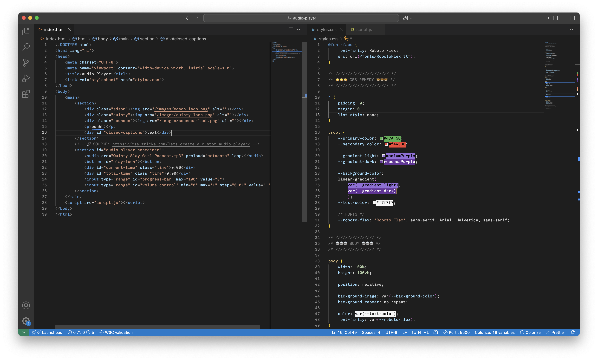

# Human Centred Design Process

## Introduction & assignment
For this assignment we had to create a digital prototype solely tailored to one person with a disability and their wishes. We each got assigned to one of three people and I was paired up with Darice who is a creative designer with a feisty personality and she has been completely deaf since the age of 27. Her wish was to be able to follow a film or podcast and get a better intention and feeling of sound and emotion through sound. I ended up going with the latter. Here you can find my process on how I did it with the tests and challenges.

# 👩🏼‍💻 Week 1

## Assignment choice
Starting with the project, I already had a slight preference to create a digital prototype based on a podcast. With this in mind, I set up some questions for the first test/introduction with Darice.

## Test #1 Introduction and orientation
During this test we were introduced to Darice and we got to ask some questions.

### Questions for Darice

#### Which podcasts do you like/seem interesting to you?
* Bims
* The Handsome Podcast
* Humorous podcasts

#### What are things you enjoy doing on the internet?
* Coding, Instagram, YouTube,  Podcasts

#### Which platforms do you like using and why? Because they're easy to use for you, or just because you enjoy them?
* Not really, typing on a phone

#### Can you experience music?
* I can distinguish different types of sounds due to later hearing loss

#### What things are difficult for you to perceive visually only? Humor, jokes? In other words, where do you miss the sound of a podcast the most?
* Sarcasm
* Certain kinds of sadness, high-pitched voices
* People talking over each other
* Voices (tones) don't come across well

#### Many podcasts are filmed — does this work for you? What does and doesn’t work?
* Works very well

#### Tips and thing to keep in mind
* Build up and structure things
* People talking off-screen are very difficult
* Feeling vibrations
* Understands types of sounds
* Include everything
* If there’s no subtitles, I assume there’s no sound
* Things you can see aren’t necessary
* You can see them, but do you really get the impact?
* Worse vision on the left side, eye patch (→ text in the center)
* Prefer names, no abbreviations

#### Ideas
* Each person their own color
* Text effects and animations
* Use color, size, flashing, and animations
* Color in the background of text
* Text depicted in images
* Speed of text/speech
* Caption for the caption for sarcasm
* Visualize sound along with the text and on screen
* Sentences that are interrupted, stitched together
* Let silence be felt — footsteps, door slamming → have visuals respond
* Eating sounds
* Separate different people/voices
* Represent the intensity of sound
* Continuously show (non-visible) emotions of people

### Concept
Darice her wish to be able to follow podcast immediately spoke to me and instantly made me think of videotaped podcasts with captions, that I myself follow without sound sometimes. When I asked her about it, she mentioned she enjoyed following these and that they work really wel for her. But that these are mostly parts of a podcast, which is why she mostly still uses the transcripted podcasts in apps such as Apple podcasts or Podimo.

I took a look at the Apple podcast transcript and immediately could envision Darice her frustration. Although, the podcast transcript is easy on the eyes and good to follow, it is boring/plain, has no emotion or nuance and it is impossible to know who is talking or interrupting, which makes it super hard to really experience what is going on and what the vibes are of the podcast. 

In addition with everything she mentioned about things that are hard for her, with key things such as people interrupting each other, people speaking off camera and nuance in emotions. And seeing that these podcast video's still miss this as well, I decided I wanted to create a digital prototype that transcripts podcasts in a fun way with emotion(like humour), vibes(like choas), nuance, people interrupting and clearly seeing who is speaking all included.

I choose a fragment of the BIMS podcasts, a podcast Darice mentioned and likes, and one I can envision, comes over completely different in a 'normal'/now standard transcript, due to the strong personalities of the people and their hectic conversations.
🔗 https://www.youtube.com/watch?v=k-sZ7wFEdNc

### Transcript setup
We immediatly got handed a convenient repository from Vasilis, that made it possible to time text/captions linked to a YouTube video.

### Sketch
I then roughly sketched out what I wanted to make:

## Next steps
For the following week I wanted to pitch my concept to Darice and make a start on coding it.

# 🤎 Week 2
## Test #2 Podcast transcript concept
During this test I pitched my idea to Darice, showed het my sketch and asked her some further questions.

### Scope of the test:
I understood last time that you prefer reading podcasts on your phone, right? That’s what I’ve based my concept on.

I especially want to focus on what you mentioned earlier — that it’s often unclear who is speaking when, a lot of nuance gets lost, and the text is quickly polished in a way that the personalities don’t really come through.

I’d like to apply this either to podcast transcriptions (like in my sketch) or even on top of video-recorded podcasts.

Right now, I’m mainly wondering what your preference would be.

#### Answer Darice:
* This is something new for me — normally, emotion doesn’t need to be in the text, but now it definitely does.
* Making interruptions clearly visible seems like a really good idea!

## Start coding
When I started coding I took the audio player of my concept as the starting point, hence everything works on the timing. 

#### Sources:
🔗 https://css-tricks.com/lets-create-a-custom-audio-player/

🔗 https://dev.to/ctrlcoding/how-to-create-a-simple-audio-player-in-html-javascript-and-css-4l2e

## Feedback 2
I quickly got some feedback from Marie and Vasilis:

#### Marie
* Gamification — make it playful
* Make/keep it interesting to read, not like a book

#### Vasilis
* Start from what you want to test
* Is timing important?
    * *Yes, timing is important to convey things such as chaos or a hectic conversation or the timing of an interruption*
* Slider for the amount of text size and/or effects; level of annoyance

## Next steps
Things I (will) changed based on the feedback and my next steps:
* Don't focus on the audio player element, because this is not necessary for the test or for a successful prototype. 
* Instead I will focus on adding the text/captions based on the timing and adding the figures and their emotions changing.

# 🥡 Week 3

## Memoji's and captions
After I received feedback in week 2, I started week 3 by focusing on what is the most important to get to work and to have ready for the next test. Which in this case was adding the captions and timing, adding the memoji's with some styling and the emotions of the memoji's changing.

### Adding Memoji's
Firstly, I added the figures in the form of Memoji's and positioned them on the screen. 
Initially, I used a `
` with an `` inside, but I realised it would be easier to use the CSS background-image property, because I can easily change this with the CSS class that is being added at certain timestaps. This way it is easier to make the image and thus emotion change.

#### With `
` and ``
` and `` elements">

#### With background-image
Adding a background-image in CSS to easily change with timings and sounds on the left.

### Adding captions and timing
I proceeded to add the captions and timings manually. Because my podcast fragment is quite hectic there was no automatic script file available. This took up quite some time.

### Changing Memoji emotion on sound
After adding the captions with their timing, I was able to add and change the different emotions/expressions of the memoji's on those same timings.

## Test #3 Transcript prototype
During this test I showed and tested my version with memoji's, the timed captions and their emotions changing.

#### Tips and feedback from Darice
* The video gets in the way
* I need to see it a few times because it’s new
* I do see a lot of potential in it
* Make the movement/changes of the characters clearer
* Make the text a bit more readable

## Iterations
* Scale the memoji up, when person is speaking
* Add a drop shadow to make it even more clear who is speaking
* Move the text up and down to make it clear when two people are speaking at the same time and interrupting each other

### Result of iterations #1
<source src="/images/process/video-week3-dropshadow.mov" alt="video of first iterations" type="video/mov">

## Next steps
* Time the text better — keep previously spoken text visible a bit longer
* Improve text readability
* Indicate speaking/text speed through timing, size, and color fill
* Make character movement clearer with size, glow, and color

# 🎞️ Week 4
## Test #4 Transcript and animation
During this test I presented my iterated prototype with upscaling of the memoji's and their drop shadow.

#### Tips and feedback from Marie
* Use more contrast
* Make use of the screen space
* Enlarge the text, characters, colors, and effects
* Be bold!

## End result
After my last test with Marie, I made some last iterations to create a complete prototype.

<video src="/images/process/video-end-result.mov" alt="Video end result" type="video/mov">